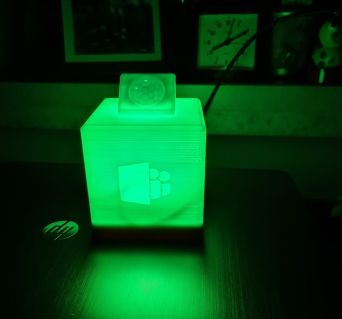
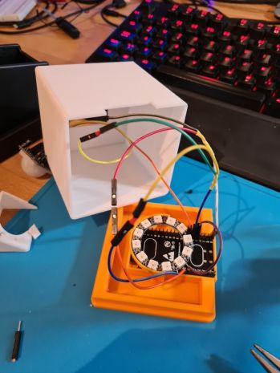

# ESP32 Teams Presence Light * * * pduck27 version * * *

This is an enhanced version of [toblum's original Teams Presence light](https://github.com/toblum/ESPTeamsPresence). Please visit his project page for more details on hard- and software.

**The following enhancements were done right now:**
- You can set a default brightness in the settings.
- After changing the configuration the ESP restarts.
- You can add an optional PIR sensor like HC-SC501 to decrease brightness if no motion is detected around the presence light.
- Absence brightness and duration can be configured in the settings.
- Important activities like "In a call" will override motion detection.

**If you connect a HC-S501 PIR please configure it like this:**
- VCC and GND can be shared with the LED ring. Data line must be connected to another Pin (default 12).
- Set the jumper to H mode "repeatable trigger", so it detects motion continiously. Should be default on most boards.
- Time signal (wheel with T) -  Should be low/average because we control the time after a motion through the code. Too high settings occurs sometime in false states. There is also a fixed delay in the code after recognizing a "detected motion" due to some lock time from the board. Please let me know when you have other experiences. My one is set to the first quarter.
- Sensitivity (wheel with S) - You can play with it, as you want.

**I also designed a case for 3D printing based on toblum's base:**
- The base can hold a ESP32 DevKitC v4 and a 12 LED ring
- The cube has an optional embedded Teams logo
- The cube has an optional PIR holder on the top.

You can find the 3D models on [Thingiverse](https://www.thingiverse.com/thing:4712835).

Modifications in the code are commented with *// pduck27*.

Thanks a lot to *toblum* for this nice project! All credits go to him.
## Licence
All code is licensed under the [MPLv2 License](https://github.com/pduck27/ESPTeamsPresence/blob/master/LICENSE).
